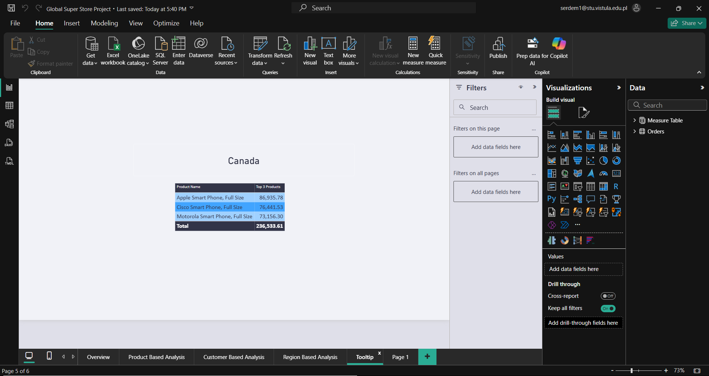

# 📊 Global Superstore — Power BI Dashboard

> A comprehensive, multi-page Power BI dashboard that delivers actionable insights into sales performance, customer segmentation, product profitability, and regional trends across the Global Superstore dataset.

   

---

## 🎯 Project Overview

This project transforms the **Global Superstore** dataset into a fully interactive, production-grade Power BI dashboard. It goes beyond basic charts — featuring **Drillthrough pages**, **Tooltip pages**, **YoY KPI comparisons**, and **advanced visualizations** such as Sankey diagrams, Sunburst charts, and animated Bar Chart Races.

The dashboard is structured into **3 analytical dimensions** (Product, Customer, Region), each with dedicated slicers, KPIs, and visualizations, connected through a seamless navigation system.

---

## 📸 Dashboard Preview

### Overview Page
Key performance indicators at a glance — total sales, profit, quantity, and year-over-year comparisons.

|  |
|:---:|
| *Overview Page — High-level KPIs and summary metrics* |

### Product-Based Analysis
Deep dive into product categories, sub-categories, and individual product profitability.

|  |
|:---:|
| *Product-Based Analysis — Category & sub-category breakdown* |

### Customer-Based Analysis
Customer segmentation insights with Tornado and Sunburst charts showing spending patterns.

|  |
|:---:|
| *Customer-Based Analysis — Segmentation & top customers* |

### Region-Based Analysis
Geographic distribution of sales and profit with map, Sankey, and animated chart race visuals.

|  |
|:---:|
| *Region-Based Analysis — Geographic sales distribution* |

### Drillthrough & Tooltip Pages
Interactive deep-dive capabilities for order-level exploration and contextual tooltips.

|  |  |
|:---:|:---:|
| *Drillthrough Page* | *Tooltip Page* |

---

## 🧮 Key Features

### Multi-Dimensional Analysis
- **Product Dimension:** Category & sub-category profitability, funnel analysis, treemap distribution
- **Customer Dimension:** Segment-based spending, top customer identification, churn indicators
- **Region Dimension:** Geographic heat analysis, market-category flow (Sankey), temporal trends

### Interactive Features
| Feature | Description |
|---------|-------------|
| **Cross-page Navigation** | Button-based navigation across all analytical pages |
| **Slicers & Filters** | Granular filtering by category, segment, region, date, and more |
| **Drillthrough** | Right-click any data point to dive into order-level detail |
| **Tooltips** | Hover over visuals to see region-specific top 3 products |
| **YoY Comparison** | Every KPI card shows current vs. previous year with % change |
| **Reset Button** | One-click filter reset on each page |

### Advanced Visualizations
- 📊 **Funnel Chart** — Top 10 profitable sub-categories & products
- 🌪️ **Tornado Chart** — Top 10 customers by sales & profit
- 🌻 **Sunburst Chart** — Segment-based customer spending hierarchy
- 🔀 **Sankey Diagram** — Market-to-Category sales flow
- 🏁 **Animated Bar Chart Race** — Regional sales over time
- 🗺️ **Map Visual** — Region-category sales distribution

---

## 📁 Project Structure

```
├── global_superstore.xlsx          # Source dataset
├── Overview Page.png               # Overview dashboard screenshot
├── Product Base Analysis Page.png  # Product analysis screenshot
├── Customer Based Analysis.png     # Customer analysis screenshot
├── Region Based Analysis.png       # Region analysis screenshot
├── Tooltip.png                     # Tooltip page screenshot
├── Drillthrough Page.png           # Drillthrough page screenshot
└── README.md                       # This file
```

---

## 🛠️ Tools & Technologies

| Tool | Purpose |
|------|---------|
| **Power BI Desktop** | Dashboard development, DAX measures, data modeling |
| **Microsoft Excel** | Data source (.xlsx) |

### DAX Measures Used
- Year-over-Year (YoY) sales, profit, and quantity calculations
- Dynamic KPI cards with conditional formatting
- Cumulative sales calculations (running totals)
- Quarterly aggregations

---

## 🚀 How to Use

### Prerequisites
- [Power BI Desktop](https://powerbi.microsoft.com/en-us/desktop/) (free)

### Steps
1. **Clone** this repository to your local machine:
   ```bash
   git clone https://github.com/<your-username>/global-superstore-dashboard.git
   cd global-superstore-dashboard
   ```
2. **Open Power BI Desktop**.
3. **Load the dataset:** `Home` → `Get Data` → `Excel Workbook` → Select `global_superstore.xlsx`.
4. **Reference the screenshots** (`.png` files) to recreate each report page.
5. Customize visuals, measures, and formatting to match your analysis goals.

---

## 📋 What This Project Demonstrates

| Skill Area | Details |
|------------|---------|
| **Data Modeling** | Star schema design, relationship management |
| **DAX** | YoY calculations, running totals, conditional logic |
| **Visualization Design** | 10+ chart types including custom visuals |
| **UX Design** | Navigation, tooltips, drillthrough, filter reset |
| **Business Analysis** | Sales, profit, customer, and regional analytics |
| **Attention to Detail** | Consistent styling, responsive layouts, KPI formatting |

---

## 📌 Key Insights from the Dashboard

- **Product:** Top sub-categories by profit margin reveal where the business should focus inventory and marketing spend.
- **Customer:** Segment analysis identifies high-value customer groups and their purchasing patterns.
- **Region:** Geographic analysis highlights underperforming markets and high-growth regions for strategic planning.

---

## 📜 License

This project is open source and available under the [MIT License](LICENSE).

---

<p align="center">
  Built with ❤️ using Power BI Desktop
</p>
